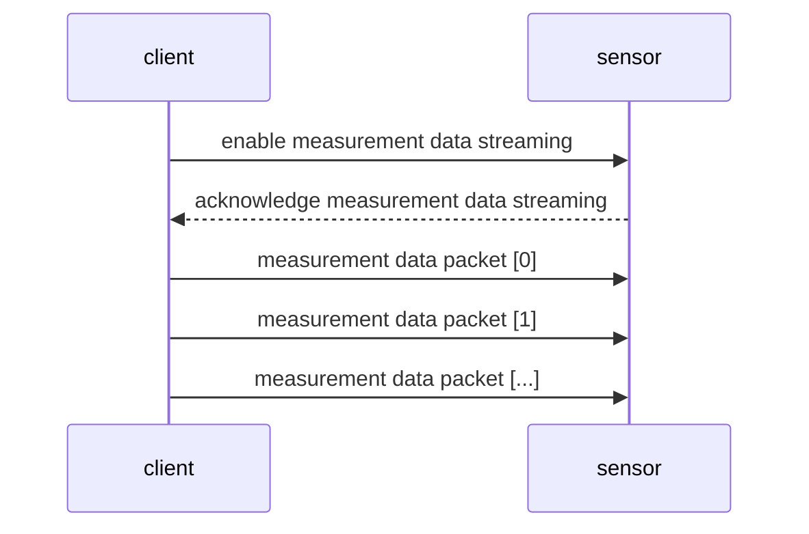
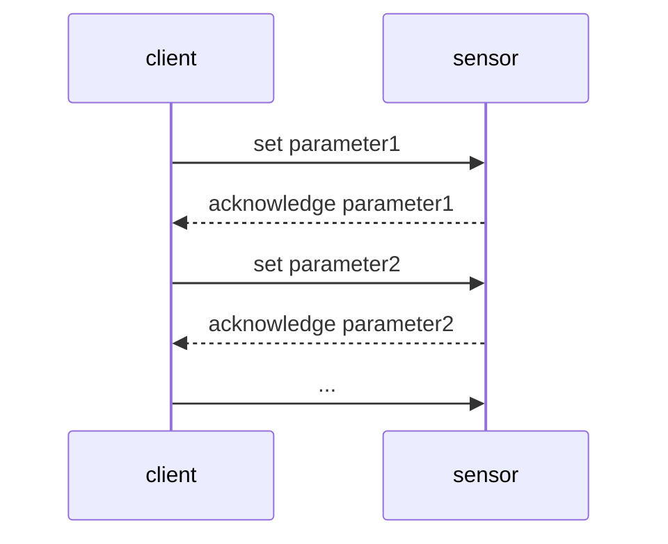

 

LiDAR API Documentation
---

This description covers all possibilities to work with the following sensors. 

- multiScan100 family
- picoScan100 family

... you have your sensor on hand: [Kick start here](#getting-started-to-work-with-a-sensor) :rocket:

# Table of content

- [Table of content](#table-of-content)
- [Introduction](#introduction)
- [General information](#general-information)
  - [Drivers and SDKs](#drivers-and-sdks)
  - [Examples](#examples)
  - [Default IP address](#default-ip-address)
- [Measurement Data Streaming - Comparison and choice](#measurement-data-streaming---comparison-and-choice)
- [Device  configuration - Comparison and choice](#device--configuration---comparison-and-choice)
- [Getting started to work with a sensor](#getting-started-to-work-with-a-sensor)
  - [:zero: Prerequisites](#zero-prerequisites)
  - [:one: See scan data on sensor web server](#one-see-scan-data-on-sensor-web-server)
  - [:two: Decide how you want to work with the device](#two-decide-how-you-want-to-work-with-the-device)
- [FAQ](#faq)
  - [I can not connect to my sensor?](#i-can-not-connect-to-my-sensor)
- [Glossary](#glossary)
  - [TCP](#tcp)
  - [UDP](#udp)
  - [HTTP](#http)
  - [REST](#rest)
  - [OpenAPI](#openapi)

# Introduction

The LiDAR API documentation differentiates between two communication concepts. For both cases there are multiple ways to work with the sensor.

**1. Receive event-driven measurement data streaming**
  - [Compact](docs/documentation-msgpack-compact.md)
  - [MSGPACK](docs/documentation-msgpack-compact.md)
  - [WebSocket](docs/documentation-websocket.md)

Communication concept of measurement data streaming:

 
 

**2. Read or write sensor parameters**
  - [REST](docs/documentation-rest.md)
  - [CoLa A](docs/documentation-cola.md)
  - [CoLa B](docs/documentation-cola.md)

Communication concept of sensor configuration:

# General information

## Drivers and SDKs

 

For complete drivers instead of single telegrams, the following options are available:

- [ROS drivers](https://github.com/SICKAG/sick_scan_xd)
- [ROS2 drivers](https://github.com/SICKAG/sick_scan_xd)
- [Python drivers](https://github.com/SICKAG/sick_scan_xd)
- [C++ drivers](https://github.com/SICKAG/sick_scan_xd)

## Default IP address

The default IP address for the sensors (if not specified different is `192.168.0.1`)

# Measurement Data Streaming - Comparison and choice

|     | Transport Layer | Port | Advantages | Bandwidth factor |
| --- |---------------------- |---------------------- | ------------------------------------------------------------------------------------------------------------------------ | ---------------- |
| **Compact** | `UDP` |default is port `2115` | - smallest traffic   - best fit for PLCs                                                                             | 1                |
| **MSGPACK** | `UDP` |default is port `2115` | - available libraries in almost all programming languages                                                                | ~2               |

# Device  configuration - Comparison and choice

|                                          | Transport Layer | Port                   | When to use what                                                                                     |
| ---------------------------------------- | --------------- | ---------------------- | ---------------------------------------------------------------------------------------------------- |
| **REST**   | `TCP`           | `80`                   | - if you only want to read data - if your system can handle a challenge and response process         |
| **CoLa A** | `TCP`           | default is port `2111` | - if your system cannot handle a challenge and response process                                  |
| **CoLa B** | `TCP`           | default is port `2112` | - if your system cannot handle a challenge and response process   - it is the best fit for PLCs. |

# Getting started to work with a sensor

## :zero: Prerequisites 

:heavy_check_mark: SICK sensor (e.g. multiScan100)

:heavy_check_mark: Power cable 

:heavy_check_mark: Ethernet cable to connect the sensor to your system

## :one: See scan data on sensor web server

- Power the sensor
- Connect the sensor to your system. (FAQ: [I can not connect to my sensor? Any ideas?](##I-can-not-connect-to-my-sensor?-AnyIdeas?))
- Open the sensor web browser (default ip address: http://192.168.0.1/)

## :two: Decide how you want to work with the device

- **Case 1**: You want to test the device and change some settings with the given web browser.
  - You are ready to got and do not need any further actions.
- **Case 2**: You want to integrate the device into a ROS environement (ROS / ROS2)
  - Please refer to our [ROS drivers](https://github.com/SICKAG/sick_scan_xd).
- **Case 3**: You want to use an existing driver (C++ or Python)
  - Please refer to our [C++ / Python driver](https://github.com/SICKAG/sick_scan_xd).
- **Case 4**: You want to build your own driver in specidic programming language.
  - Decide which measurement data straming approach you want you use. You can choose from these:
    - Compact Format via `UDP`
    - MSGPACK Format via `UDP`
    - ScanData via `WebSockets`
  - Decide which sensor configuration approach you want you use. You can choose from these:
    - HTTP/REST via `TCP`
    - CoLa via `TCP`

# FAQ

## I can not connect to my sensor?

Make sure your sensor and client system is in the same subnet. You want to either change the subnet of your ethernet interface or you want to change the IP address of the sensor.

**Change subnet of client system**

You want make sure
> NOTE 
> It's important to note that changes the IP address on your computer may affect your ability to connect to other sensors on your network or access the internet. 

**Windows**
To change the IP address on a Windows computer, you can follow these steps:
  
- Open the Start menu and search for "Control Panel."
- Click on "Network and Sharing Center" in the Control Panel.

# Glossary

## TCP
TCP (Transmission Control Protocol) is a transport-layer protocol used to establish and maintain connections between devices on a network. It is responsible for ensuring that data is transmitted reliably and in the correct order, by using a system of acknowledgements and retransmissions.

## UDP
UDP (User Datagram Protocol) is a transport-layer protocol used for communication in a computer network. It is a connectionless protocol, meaning that it does not establish a dedicated connection before sending data, unlike TCP (Transmission Control Protocol). This makes UDP faster and more efficient, but also less reliable because there is no built-in mechanism for error checking and retransmission of lost packets.

## HTTP
HTTP (Hypertext Transfer Protocol) is an application-layer protocol that is used to transmit data over the internet. It is the foundation of the web, and is used by browsers to request and receive information from web servers. HTTP defines a set of request methods, such as GET, POST, PUT, and DELETE, which are used to indicate the desired action to be performed on a specified resource.

## REST
REST (Representational State Transfer) is an architectural style for building web services. It is based on the principles of HTTP and is designed to work with the existing infrastructure of the web. RESTful web services use HTTP methods to indicate the desired action to be performed on a specified resource, and return data in a format that can be easily consumed by a client, such as JSON or XML.

## OpenAPI
OpenAPI is a specification for building RESTful web services. It is used to describe the structure and behavior of an API (Application Programming Interface), including the available endpoints, the request and response formats, and the authentication methods. OpenAPI is a machine-readable format, which means that tools can be used to generate client libraries, documentation, and other artifacts based on the specification. This makes it easy for developers to understand and interact with an API, and also helps ensure consistency across different implementations.
